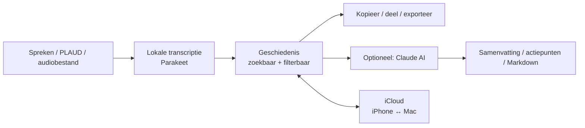
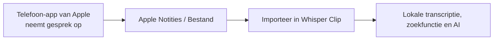

# Whisper Clip — projectstatus

> [!summary] Stand van zaken
> **Whisper Clip werkt nu als persoonlijke, lokale transcriptie-app voor iPhone en Mac.**
> Opnemen, transcriptie, geschiedenis, notities, iCloud-sync, woordenlijst,
> vaste deelnemers, PLAUD-import en optionele Claude-verwerking zijn gebouwd.
> De resterende werkzaamheden zijn vooral testwerk, robuustheid bij lange
> AI-verzoeken en voorbereiding op een eventuele openbare release.

## 1. Het product in één minuut

Whisper Clip is Niels' eigen alternatief/aanvulling op MacWhisper, PLAUD en
losse notities. De kern: gesproken tekst wordt lokaal getranscribeerd, blijft
doorzoekbaar en kan — alleen wanneer Niels dat kiest — worden samengevat of
omgezet naar bijvoorbeeld actiepunten, notulen of Markdown.

De beoogde dagelijkse route is:

## 2. Wat werkt nu

| Onderdeel | Status | Wat het doet |
|---|---|---|
| iPhone opnemen | Werkt | Lokaal inspreken, transcriberen, kopiëren en bewaren in Geschiedenis. |
| Mac dicteren | Werkt | Snel dicteren naar klembord/invoegen, plus transcriptiegeschiedenis. |
| Bestanden openen | Werkt op Mac | Gekozen audio- of videobestanden lokaal transcriberen. |
| Geschiedenis | Werkt | Zoeken, sorteren, filteren en transcripties openen op iPhone en Mac. |
| Notities | Werkt | Doorlopende notities met meerdere ingesproken stukken. |
| Notulen | Basis werkt; afronding gepland | Deelnemers kiezen, lokaal opnemen en een e-mail voorbereiden. De transparantie-uitleg, bewaar-toestemming en optionele AI-notulen worden nog afgerond. |
| iCloud-geschiedenis | Werkt en getest | Transcripties, notities en wijzigingen tussen eigen iPhone en Mac synchroniseren. |
| Woordenlijst | Werkt en getest | Eigen correcties, zoals `klot` → `Claude`, synchroniseren tussen iPhone en Mac. |
| Vaste deelnemers | Werkt en getest | Contacten voor Notulen synchroniseren via iCloud tussen iPhone en Mac. |
| PLAUD-import op iPhone | Gebouwd | iPhone is de primaire plek: PLAUD → Whisper Clip → iCloud → Mac. |
| PLAUD-import op Mac | Bewust uitgeschakeld | Om dubbele routes en dubbele transcripties te voorkomen. De Mac ontvangt via iCloud. |
| Claude AI | Werkt | Alleen op expliciet verzoek een transcript naar Claude sturen voor bewerking. |
| API-kosten | Werkt | Kosten/verbruik worden in instellingen weergegeven, met detail per periode. |
| AI-woordenlijstsuggesties | Werkt | Claude stelt correcties voor; Niels kiest zelf welke regels worden toegevoegd. |

## 3. Apparaten en rollen

| Apparaat | Rol nu | Belangrijke beperking / keuze |
|---|---|---|
| iPhone | Hoofdapparaat voor snel opnemen, Notulen en PLAUD-import | Alleen iPhone en Mac zijn nu in scope. |
| Mac | Volwaardige werkplek voor dicteren, bestanden en uitgebreide geschiedenis | Ontvangt PLAUD-transcripties via iCloud, importeert PLAUD niet zelf. |
| iPad | Nog niet gebouwd | Bewust uitgesteld. |
| Apple Watch | Nog niet gebouwd | Bewust uitgesteld. |
| Werk-Mac met ander Apple-account | Nog geen gedeelde sync-route | Lokale app kan wel werken; delen van geschiedenis vereist later een aparte, veilige oplossing. |

## 4. Gegevens, privacy en waar alles staat

### Lokaal en iCloud

- Transcriptie gebeurt lokaal met **Parakeet / CoreML**.
- Audio van gewone iPhone-opnames en Notulen wordt niet als blijvend audiobestand
  door Whisper Clip bewaard; de transcriptietekst wordt nu wel als
  geschiedenisitem bewaard.
- Geschiedenis en notities kunnen via **iCloud/CloudKit** tussen apparaten met
  hetzelfde iCloud-account synchroniseren.
- De woordenlijst en vaste deelnemers synchroniseren eveneens tussen iPhone en
  Mac.
- PLAUD-audio wordt tijdelijk op de iPhone gedownload om te transcriberen en
  daarna verwijderd. De getranscribeerde tekst blijft in Whisper Clip staan.

### Claude / AI

- Alleen wanneer Niels zelf een AI-opdracht start, gaat de gekozen
  transcriptietekst naar Anthropic's Claude API.
- Geen audio gaat naar Claude.
- De API-sleutel staat in de Keychain van het betreffende apparaat en hoort
  **nooit** in Obsidian, Git, screenshots of dit document te staan.
- Kosten worden lokaal bijgehouden in de app.

### Belangrijke documentatie

- [[PRIVACY]] — privacy- en gegevensstroomdocument. **Let op:** dit document
  moet vóór een publieke release worden bijgewerkt: de huidige app ondersteunt
  inmiddels iCloud-geschiedenissync en iPhone-PLAUD-sync.
- [[TODO]] — compacte technische werklijst.
- Dit document is de leesbare productstatus voor Obsidian.

## 5. Belangrijkste ontwerpbeslissingen

1. **Telefoon is primair voor PLAUD.**
   De PLAUD-app synchroniseert eerst met de PLAUD-cloud. Daarna haalt Whisper
   Clip op de iPhone de geselecteerde periode op, transcribeert lokaal en stuurt
   de tekst via iCloud naar de Mac. Dit voorkomt een onhandige heen-en-weerroute.

2. **Geen dubbele PLAUD-import op de Mac.**
   De Mac-route is bewust uitgezet. Een PLAUD-opname wordt herkend aan zijn
   PLAUD-id en niet dubbel verwerkt.

3. **AI is expliciet en optioneel.**
   Claude draait nooit automatisch. AI-resultaten verschijnen als compacte
   resultaten die je opent wanneer je ze wilt lezen, niet als enorme blokken in
   een transcript.

4. **Woordenlijst is veilig voorgesteld, niet automatisch toegepast.**
   AI kan `mek → Mac` of `Whisperclip → Whisper Clip` voorstellen. Niels kiest
   per regel of die aan de woordenlijst wordt toegevoegd. Dat voorkomt dat een
   te agressieve regel bestaande correcte woorden kapotmaakt.

5. **Rustig ontwerp op iPhone.**
   Elke hoofdtab heeft bovenaan `Whisper Clip.`. Notulen, Notities en
   Geschiedenis hebben daaronder een grote eigen titel; Opnemen niet. Korte
   uitlegteksten kunnen via **Instellingen → Thema → Hulptips tonen** worden
   uitgezet.

6. **Kopieer, deel en AI zijn vaste acties op een transcript.**
   Vooral bij lange PLAUD-transcripties blijven die acties bereikbaar; delen is
   de route voor e-mail, WhatsApp, opslaan in Bestanden en toekomstige
   Markdown/Obsidian-export.

7. **Notulist blijft neutraal.**
   Een Notulist-transcriptie is altijd één doorlopende tekst: geen
   sprekerherkenning, labels of automatische namen. Deelnemers zijn uitsluitend
   e-mailontvangers; de app suggereert niet dat zij aan uitspraken gekoppeld
   kunnen worden.

8. **AI bij Notulen wordt een dubbele expliciete keuze.**
   De algemene instelling maakt de mogelijkheid zichtbaar (standaard uit); per
   vergadering moet AI daarna opnieuw expliciet worden aangezet. Zonder die
   keuze blijft de volledige Notulist-route lokaal en zonder AI.

## 6. Geschiedenis: zoeken, filters en sorteren

De Geschiedenis is de centrale bibliotheek.

- Vrij zoeken in transcripties.
- Filter op bron/apparaat: **iPhone**, **Mac**, **PLAUD** en ouder/onbekend.
- Filter op lengte, aantal sprekers en titelstatus.
- Sorteren op datum, naam en lengte.
- Iedere opname houdt onder meer bron, datum/tijd, duur, taal, eventuele
  sprekers, titel en transcriptietekst bij.
- PLAUD-titels gebruiken nu het begin van de transcriptie wanneer er geen eigen
  titel is, in plaats van overal `PLAUD-opname`.

## 7. AI-bibliotheek

De app bevat onder meer deze soorten opdrachten:

- adaptieve samenvatting;
- korte en uitgebreide samenvatting;
- belangrijkste punten;
- actiepunten;
- notulen;
- doktersafspraak;
- e-mail;
- LinkedIn-post;
- onderwijs-/teaching notes;
- redeneringsoverzicht;
- volledig, opgeschoond transcript voor extern gebruik;
- verbeterde transcriptie;
- vrije eigen vraag.

Uitgangspunt voor elke opdracht: geen feiten verzinnen, onzekerheid benoemen en
duidelijke kopjes gebruiken. De prompts zijn geïnspireerd door de structuur van
sterke PLAUD-sjablonen, maar zijn eigen Whisper Clip-opdrachten.

## 8. Openstaande taken — eerstvolgende volgorde

### Eerst testen (belangrijkste)

- [ ] Maak één **nieuwe** PLAUD-opname na deze datum en controleer de volledige
  keten: PLAUD-app → Whisper Clip op iPhone → lokale transcriptie → iCloud →
  zichtbaar op Mac.
- [ ] Test een gewone nieuwe iPhone-opname en controleer of die op de Mac
  verschijnt.
- [ ] Test één Mac-dictaat en controleer of die op de iPhone verschijnt.
- [ ] Test woordenlijst en vaste deelnemer nog eenmaal beide kanten op.
- [ ] Test één AI-opdracht op een korte transcriptie en één op een lange
  transcriptie.

### Robuustheid / kwaliteit

- [ ] Lange transcripties betrouwbaar door Claude laten verwerken zonder
  time-out of onvolledig resultaat. Waarschijnlijke oplossing: tekst opdelen,
  per deel verwerken en zorgvuldig samenvoegen.
- [ ] De nieuwe AI-opdrachten inhoudelijk naast echte PLAUD-resultaten leggen
  en de prompts waar nodig aanscherpen.
- [ ] Lege schermen, foutmeldingen, ontbrekende verbinding en afgebroken sync
  nog één keer systematisch nalopen.
- [ ] Privacydocument actualiseren aan de huidige iCloud- en PLAUD-route.
- [ ] Notulist afmaken volgens [[HANDOVER_2026-07-31]]: neutrale doorlopende
  transcriptie, AI alleen met dubbele expliciete toestemming, contact bewaren
  alleen met toestemming en een geteste uitleg/voorleesstem.

### Alleen als we gaan uitgeven

- [ ] Herstel na app-update testen zonder geschiedenis kwijt te raken.
- [ ] TestFlight-versie maken en installeren.
- [ ] Privacytekst, toestemmingen, App Store-beschrijving en ondersteuning
  afmaken.

## 9. Ideeën voor later

### Waarschijnlijk waardevol

- Import vanuit Apple Notities / Dictafoon / Bestanden, vooral voor door Apple
  opgenomen telefoongesprekken zodra die functie in Nederland beschikbaar is.
- Eén-tik-export als Markdown naar Obsidian.
- Projecten, labels of mappen voor transcripties.
- Zelfgekozen titelvoorstellen na een opname.
- Sjablonen per gesprekstype: klant, coaching, brainstorm, arts, webinar,
  les, vergadering.
- Een vraag stellen over meerdere geselecteerde transcripties.
- Betere e-mail-/deelworkflow: eerst gewone samenvatting, daarna optioneel
  `Verstuur` of `Deel`.
- Eigen, minder blikkerige voorleesintro voor de Notulist (M4A, MP3 of WAV).

### Productuitbreidingen

- iPad-interface.
- Apple Watch: extreem eenvoudige opname-start/stop, geen volledige editor.
- Veilige gedeelde Whisper Clip-ruimte voor een werk-Mac met ander iCloud-account.
- Een persoonlijke “inbox”: nieuwe transcripties eerst beoordelen, daarna naar
  notitie/project/archief verplaatsen.
- Automatische maar controleerbare titel- en tagsuggesties.
- Lokale, snellere transcriptie-engine als Parakeet later niet snel genoeg is.

## 9a. Richting voor een openbare App Store-versie

De huidige persoonlijke versie mag PLAUD en Niels' eigen iCloud-route bevatten.
Voor een toekomstige app voor anderen is de beoogde, eenvoudiger basis:

| Onderdeel | Keuze voor openbare versie |
|---|---|
| Firebase | Niet gebruiken: geen Firebase, analytics of eigen backend. |
| PLAUD | Niet opnemen; geen publieke PLAUD-koppeling zonder aparte afspraken. |
| iCloud | Vrijwillige instelling; gebruikt het bestaande Apple-account op het toestel, zonder inloggen in Whisper Clip. |
| AI | Optioneel met eigen API-sleutel van de gebruiker. Eerste aanbieders: Claude, OpenAI en Google Gemini. |
| AI-data | Alleen gekozen tekst, nooit audio; duidelijke toestemming per opdracht. |

Deze keuzes moeten technisch, privacyrechtelijk en in App Store Connect nog
worden uitgewerkt vóór openbare distributie.

### Internationalisatie en professionele edities

- Openbare Whisper Clip: minimaal Nederlands, Engels en Duits, zowel interface
  als App Store-pagina. App-taal en gesproken transcriptietaal worden aparte
  instellingen.
- De transcriptie-engine kent al meertalige detectie; de vaste NL/EN/DE-keuze
  en kwaliteitstest horen nog op de releasewerklijst.
- Mogelijke aparte **GHX-editie**: dezelfde kern, maar eigen naam, bundel-id,
  huisstijl en besloten distributie. Geen medische claims zonder aparte
  beoordeling.
- ISO/IEC 27001 is een organisatiebreed informatiebeveiligingsmanagementsysteem;
  geen enkelvoudig app-label. Of medische MDR/CE-regels spelen, hangt af van de
  geclaimde intended purpose, niet alleen van gebruik in een ziekenhuis.

## 10. Telefoongesprekken: huidige werkelijkheid

Whisper Clip kan op dit moment **geen audio van gewone mobiele telefoongesprekken
rechtstreeks opnemen**. iOS geeft een gewone app die audiotoegang niet.

Apple heeft een eigen opnamefunctie in de Telefoon-app, maar die is volgens
Apple momenteel niet beschikbaar in de Europese Unie. Waar die functie wel
beschikbaar is, horen beide gesprekspartners een opname-aankondiging.

Mogelijke toekomstige Whisper Clip-route:

Juridische vuistregel voor Nederland: neem alleen gesprekken op waaraan je zelf
deelneemt, vertel de ander vooraf dat je opneemt en deel een opname niet zomaar.
Dit is productinformatie, geen individueel juridisch advies.

## 11. Technische oriëntatie

| Onderdeel | Locatie |
|---|---|
| Xcode-project | `v2/WhisperClipboard.xcodeproj` |
| iPhone-app | `v2/WhisperClipboardiOS/` |
| Mac-app | `v2/WhisperClipboard/` |
| Gedeelde data/sync | `v2/Packages/Shared/Sources/WhisperShared/` |
| AI-prompts/modi | `v2/Packages/Core/Sources/Core/AI/Modes.swift` |
| PLAUD op iPhone | `v2/WhisperClipboardiOS/PLAUD/` |
| Privacydocument | `v2/PRIVACY.md` |
| Korte technische TODO | `v2/TODO.md` |

## 12. Wat niet in dit document hoort

Nooit hier opnemen:

- Claude API-sleutel;
- PLAUD-sessie/token/wachtwoord;
- Apple-/iCloud-wachtwoorden;
- persoonlijke transcripties of e-mailadressen van deelnemers;
- codes uit Keychain, screenshots of terminaluitvoer.

---

## Korte overdracht voor een volgende werksessie

**Begin met testen, niet met nieuwe functies.** Als iPhone ↔ Mac ↔ iCloud en
PLAUD één hele ronde goed doorlopen, is de basis sterk. Kies daarna één lange
transcriptie om AI-time-outs op te lossen. Pas vervolgens prompts en export aan;
iPad, Watch en gedeelde werkruimte zijn nadrukkelijk geen blokker voor de
huidige bruikbare versie.
